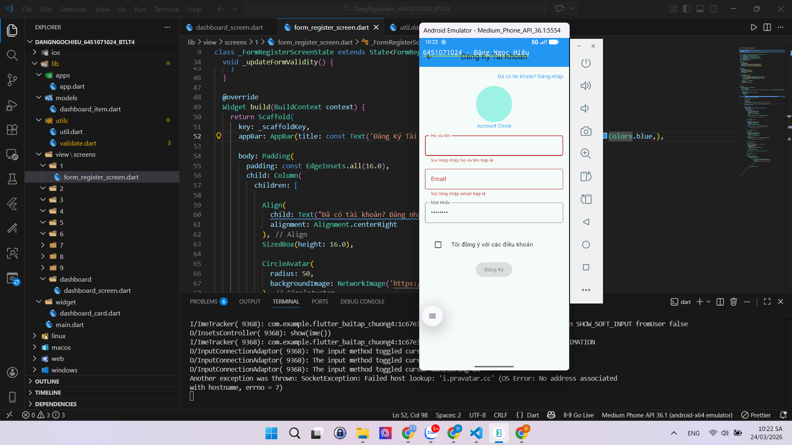
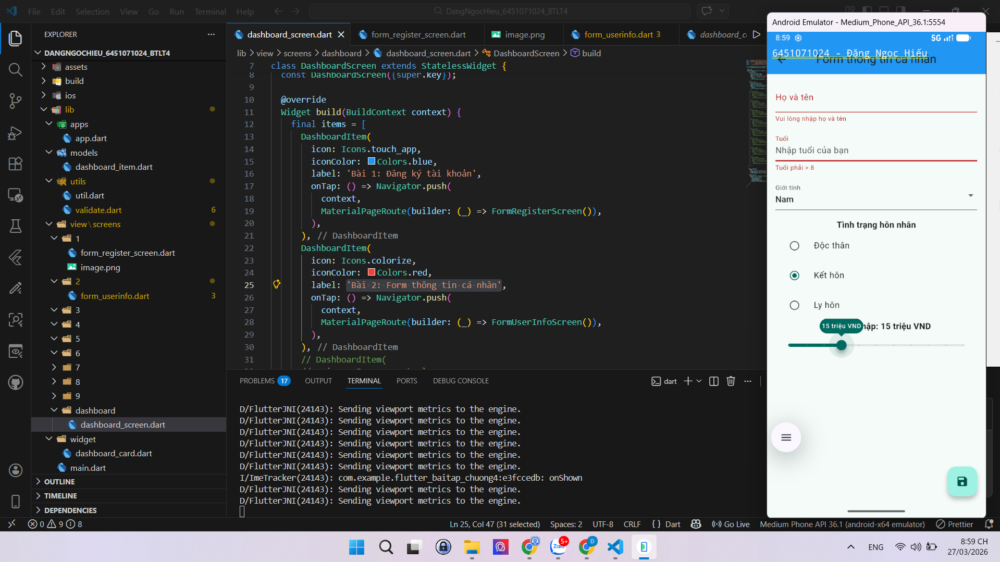
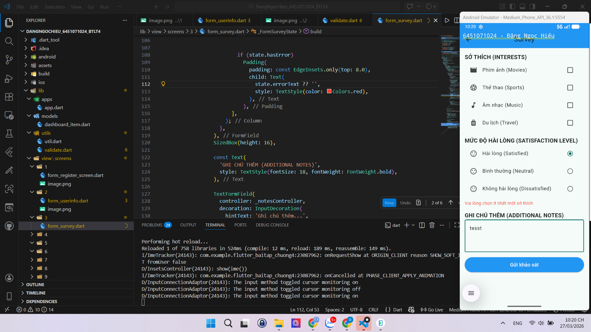
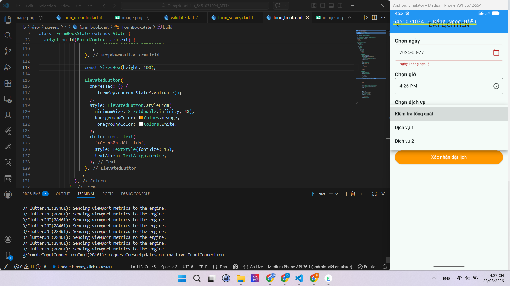
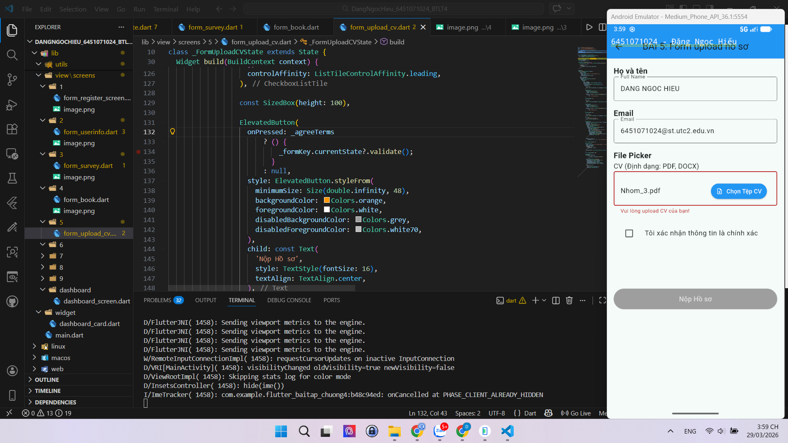
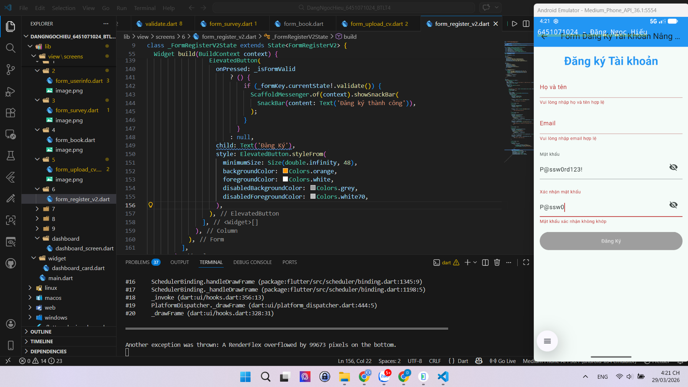
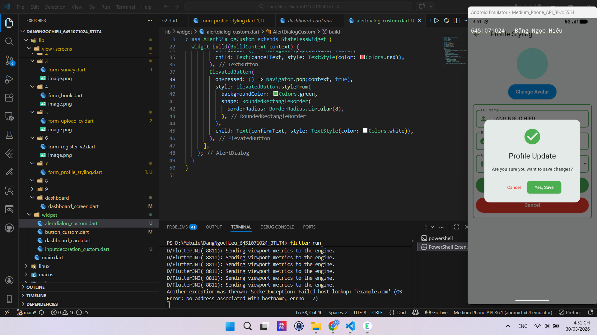

# Flutter Bài Tập Chương 4

**Sinh viên:** Đặng Ngọc Hiếu
**MSSV:** 6451071024
**Môn:** Lập Trình Ứng Dụng Trên Thiết Bị Di Động

---

## Cấu Trúc Thư Mục

```
lib/
├── main.dart
├── apps/
│   └── app.dart
├── models/
│   └── dashboard_item.dart
├── utils/
│   ├── util.dart
│   └── validate.dart
├── widget/
│   ├── dashboard_card.dart
│   └── button_custom.dart
└── view/
    └── screens/
        ├── dashboard/
        │   └── dashboard_screen.dart
        ├── 1/
        │   └── form_register_screen.dart
        ├── 2/
        │   └── form_userinfo.dart
        ├── 3/
        │   └── form_survey.dart
        ├── 4/
        │   └── form_book.dart
        ├── 5/
        │   └── form_upload_cv.dart
        ├── 6/
        │    └── form_register_v2.dart
        └── 7/
            └── form_profile_styling.dart
```

---

## Danh Sách Bài Tập

### Bài 1: Form Đăng Ký Tài Khoản



---

### Bài 2: Form Thông Tin Cá Nhân



---

### Bài 3: Form Survey (Khảo Sát)



---

### Bài 4: Form Đặt Lịch Hẹn



---

### Bài 5: Form Upload Hồ Sơ (CV)



---

### Bài 6: Form Đăng Ký Tài Khoản Nâng Cao



---

### Bài 7: Form Chỉnh Sửa Hồ Sơ Cá Nhân

